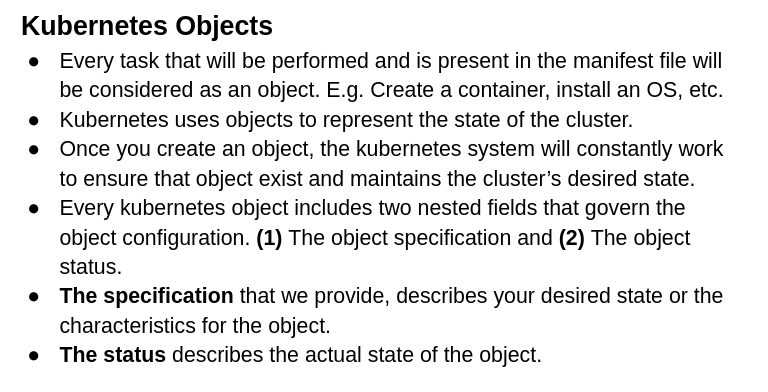
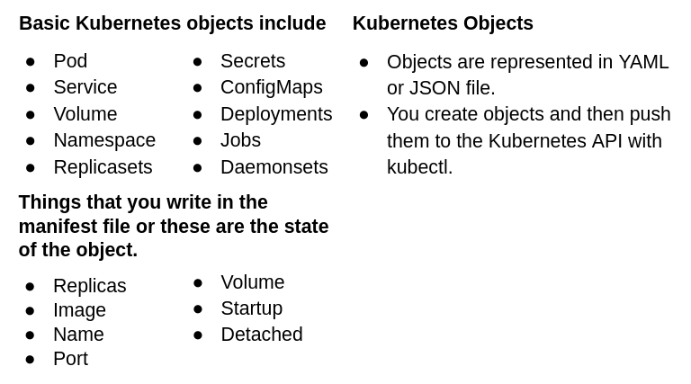

On the twenty-third day, I learned the following things about Kubernetes.

 
    

 
    

- First update the machine by writing `sudo apt-get update`.

- Install **kubectl** by visiting this [page](https://kubernetes.io/docs/tasks/tools/).

- Install **minikube** by visiting this [page](https://minikube.sigs.k8s.io/docs/start/).

- `sudo apt-get conntrack` will make the minikube start working properly.

- `minikube start` will start the minikube cluster that has one control plane and a worker node. We set the vm-driver equal to none to not run other functionalities.

- `minikube status` will show the status of the minikube.

- `minikube version` will show the version of minikube.

- `minikube dashboard` will show you the minikube dashboard in your browser.

- `minikube docker-env` will give some environment variables that will help you to communicate with remote servers.

- `minikube ssh` will take you inside the minikube.

- `docker container ls` will show you the list of containers that are required for Kubernetes.

- `docker ps` will show you the list of containers that are required for Kubernetes.

- `kubectl get pods` will show you the pods that are running.

- `kubectl get nodes` will show you the nodes that are running.

- `kubectl describe node node-name` will show you the information about a particular node.

**Data in YAML file**

    kind: Pod
    apiVersion: v1
    metadata:
      name: testpod
    spec:
      containers:
        - name: c00
          image: ubuntu
          command: ["/bin/bash", "-c", "while true; do echo Hello-Bilal; sleep 5; done"]
    restartPolicy: Never	#Defaults to Always

- `kubctl apply -f pod.yml` will run the comands that are present in the yaml file.

- `kubectl get pods -o wide` will show you the exact location of the pods with their ip addresses.

- `kubectl describe pod pod-name` OR `kubectl describe pod/pod-name` will show each and every detail of a pod.

- `kubectl logs -f pod-name` will show you the information of the container(s) in a specific pod.

- `kubectl logs -f pod-name -c container-name` will show you the information of a specific container in a specific pod.

- `kubectl exec pod-name -it -c container-name -- hostname -i` will show you the ip the address of the pod that contain these containers.

- `kubectl delete pod pod-name` OR `kubectl delete -f pod.yaml` will delete a specific pod. A pod can either be deleted by pod-name or a filename that contains the pod information.

- Now write annotations for the description of a pod.

      kind: Pod
      apiVersion: v1
      metadata:
        name: testpod
        annotations:
          description: Our first test pod is created.
      spec:
      ...

**Data in YAML file for multiple containers**

    kind: Pod
    apiVersion: v1
    metadata:
      name: testpod2
    spec:
      containers:
      - name: c00
        image: ubuntu
        command: ["/bin/bash", "-c", "while true; do echo Hello-Bilal; sleep 5; done"]
      - name: c01
        image: ubuntu
        command: ["/bin/bash", "-c", "while true; do echo Hello-Khan; sleep 5; done"]

- `kubectl exec pod-name -it -c container-name -- /bin/bash` will move you inside the container.

- `ps -ef` will show you the things that are running inside the container.

**Writing environment variables in YAML file**

    kind: Pod
    apiVersion: v1
    metadata:
        name: environment
    spec:
      containers:
        - name: c00
          image: ubuntu
          command: ["/bin/bash", "-c", "while true; do echo Environment-variables; sleep 5; done"]
          env:
            - name: MYNAME
              value: Bilal

- After going inside the container by this command `kubectl exec pod-name -it -c container-name -- /bin/bash`, type `env` to get the environment variables.

- `echo $MYNAME` to get the environment variable value.

- `kubectl config view` will show you the information about the cluster.

- `kubectl config current-context` will display the current context.

- `kubectl get all` will show you the pods, services, deployment, replicaset etc.

- `minikube stop` will stop the minikube.

## **Explaining it in a video**

Here you can get the explanation in a video. [23/100 Days DevOps Challenge]()