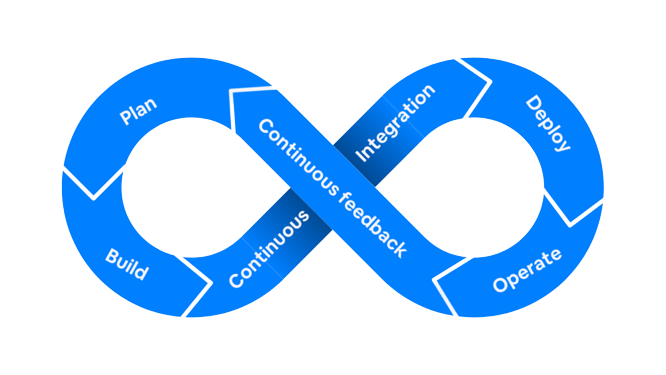

# 100-Days-Of-DevOps

 
    

This repository is used to document my journey of **100 Days of DevOps** challenge. The reason for this documentation is to help others understand the things that are required for *DevOps*.

This journey will not cover all things about "DevOps" but it will cover the areas that I feel will benefit my learning and understanding overall.

I have created 100 videos for 100 days. So if you don't understand the documentation, you can watch the videos also.

I hope you will enjoy this journey. Happy learning!

# Progress

## **Use Git and GitHub**
- 📚 [Day No.1 of Learning Git](Days/day1.md)
- 📚 [Day No.2 of Learning Git](Days/day2.md)
- 📚 [Day No.3 of Learning GitHub](Days/day3.md)

## **Understand Networking**
- 🌐 [Day No.4 of Learning Networking](Days/day4.md)
- 🌐 [Day No.5 of Learning Networking](Days/day5.md)
- 🌐 [Day No.6 of Learning Networking](Days/day6.md)
- 🌐 [Day No.7 of Learning Networking](Days/day7.md)
- 🌐 [Day No.8 of Learning Networking](Days/day8.md)
- 🌐 [Day No.9 of Learning Networking](Days/day9.md)
- 🌐 [Day No.10 of Learning Networking](Days/day10.md)
- 🌐 [Day No.11 of Learning Networking](Days/day11.md)

## **Learning Linux**
- 🐧 [Day No.12 of Learning Linux](Days/day12.md)
- 🐧 [Day No.13 of Learning Linux](Days/day13.md)
- 🐧 [Day No.14 of Learning Linux](Days/day14.md)

## **Learning YAML**
- ⌨️ [Day No.15 of Learning YAML](Days/day15.md)
- ⌨️ [Day No.16 of Learning YAML](Days/day16.md)
- ⌨️ [Day No.17 of Learning YAML](Days/day17.md)

## **Understanding Docker**
- 🏗️ [Day No.18 of unerstanding Docker and Containers](Days/day18.md)
- 🏗️ [Day No.19 of unerstanding Docker and Containers](Days/day19.md)
- 🏗️ [Day No.20 of unerstanding Docker and Containers](Days/day20.md)

## **Author Info**

- YouTube - [Developer Bilal](https://www.youtube.com/channel/UCBLTfRg0Rgm4FtXkvql7DRQ)
- LinkedIn - [ibilalkayy](https://www.linkedin.com/in/ibilalkayy/)
- Twitter - [ibilalkayy](https://twitter.com/ibilalkayy)

[Back to Top](#100-Days-Of-DevOps)